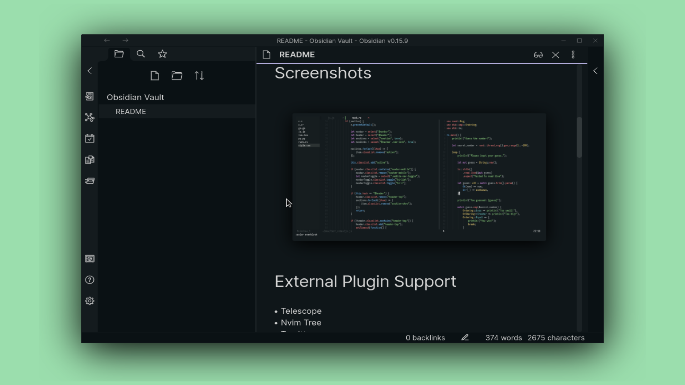

<h2 align="center">Everblush Obsidian Theme</h2>

<p>
<h4 align="center"> <i>Obsidian Markdown Editor with Everblush</i> </h4>
</p> 

<p align="center"> 
 


</p>

# Preview 
<p align="center"> 
 
</p>

## Installation
- Add obsidian.css to ```$HOME/.obsidian/themes```.
- Navigate to `Settings` >> `Appearance` >> `Manage` >> And Select the theme. 
- Or just install it from Plugins Section.
